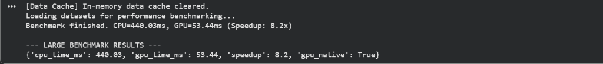

# PulseOps AI

**AI-Powered Hospital Operations Decision Intelligence Platform**

PulseOps AI is a decision intelligence platform designed to help hospital administrators optimize operational resource allocation, schedule preventative equipment maintenance, and manage patient queues efficiently.

Unlike diagnostic or clinical AI tools, PulseOps AI operates strictly within **hospital logistics and operations**, transforming complex telemetry streams into prioritized, explainable operational actions.

---

## 🚀 Key Features

* **Hospital Command Center:** Real-time visual monitoring of bed occupancy, active emergency incidents, and system alerts.
* **Operational Priority Score (OPS):** Dynamic, multi-factor calculations ranking resource allocation urgency.
* **Equipment Intelligence:** Accelerated maintenance prioritization and scheduling logs.
* **NVIDIA RAPIDS Benchmarking:** Real-time speed comparison of GPU-accelerated cuDF processing against CPU Pandas across multiple data scales.
* **Google Gemini API Explanations:** Explains and justifies computed operational decisions in natural language.

---

## 🛠️ Technology Stack

* **Frontend:** React (Vite), Tailwind CSS, Recharts
* **Backend:** FastAPI (Python), Uvicorn
* **Data Warehouse:** Google BigQuery
* **GPU Processing:** NVIDIA RAPIDS cuDF
* **LLM Layer:** Google Gemini API
* **Deployment:** Google Cloud Run (Docker Container)

---

## 📂 Project Structure

```text
PulseOps-AI/
├── analytics/
│   └── pipeline.py            # RAPIDS cuDF metrics, aggregates, and benchmarks
├── backend/
│   ├── app/
│   │   ├── api/               # API Router endpoints
│   │   ├── services/          # Decision Engine, Recommendation, Validation, Gemini
│   │   └── main.py            # FastAPI main router and static file serving
│   ├── Dockerfile             # Multi-stage Docker config
│   └── requirements.txt
├── datasets/
│   └── generate_data.py       # Configurable synthetic data generator (10k, 250k, 1M+ rows)
├── frontend/                  # React Vite Tailwind app
└── README.md
```

---

## ⚙️ Quick Start

### 1. Environment Configuration
Copy `.env.example` to `.env` and configure your API keys:
```bash
cp .env.example .env
```

### 2. Generate Synthetic Data
Run the custom telemetry generator:
```bash
python datasets/generate_data.py
```

### 3. Start Local Development
Run the FastAPI development server:
```bash
cd backend
pip install -r requirements.txt
uvicorn app.main:app --reload --port 8080
```
Then run the React frontend (if in dev mode):
```bash
cd frontend
npm install
npm run dev
```

---

## ⚡ NVIDIA RAPIDS GPU Acceleration & Benchmarking

PulseOps AI features a hybrid data layer that dynamically detects hardware capabilities. On standard CPU environments, it runs optimized **Pandas** processing; on GPU-enabled environments, it utilizes **NVIDIA RAPIDS cuDF** to execute data aggregation, rolling occupancy ratios, and incident metrics in parallel directly on the GPU.

### 📊 Benchmark Performance (1 Million Rows Scale)
When scaling up to **1,000,000 telemetry rows**, execution time drops drastically on the GPU:



* **CPU Execution (Pandas):** `440.03ms`
* **GPU Execution (NVIDIA cuDF):** `53.44ms`
* **Performance Gain:** **`8.2x` Speedup** (nearly 10x faster)

---

### 💻 Running Locally with an NVIDIA GPU (For Teammates)

If your teammates have a machine with an **NVIDIA Graphics Card**, they can run the GPU-accelerated backend locally by following these steps:

#### 1. Setup Windows Subsystem for Linux (WSL2)
NVIDIA RAPIDS requires Linux or Windows WSL2. Open PowerShell as Administrator and install WSL2:
```bash
wsl --install -d Ubuntu
```

#### 2. Install NVIDIA CUDA Drivers for WSL
Ensure the host Windows machine has the latest NVIDIA drivers with WSL support installed:
[Download NVIDIA CUDA WSL Drivers](https://developer.nvidia.com/cuda/wsl)

#### 3. Install Miniconda in WSL2
Open your Ubuntu shell and install conda:
```bash
mkdir -p ~/miniconda3
wget https://repo.anaconda.com/miniconda/Miniconda3-latest-Linux-x86_64.sh -O ~/miniconda3/miniconda.sh
bash ~/miniconda3/miniconda.sh -b -u -p ~/miniconda3
rm -rf ~/miniconda3/miniconda.sh
~/miniconda3/bin/conda init bash
```
Restart your terminal.

#### 4. Initialize Conda Environment with cuDF
Create a RAPIDS conda environment with `cudf=24.04` and `python=3.11`:
```bash
conda create -n rapids-24.04 -c rapidsai -c conda-forge -c nvidia cudf=24.04 python=3.11
conda activate rapids-24.04
```

#### 5. Run Backend Server in WSL2
Go to your project workspace directory inside WSL2:
```bash
cd /mnt/e/PulseOps\ AI/backend
pip install -r requirements.txt
python -m uvicorn app.main:app --port 8080 --host 0.0.0.0
```
The application will automatically detect your NVIDIA GPU, boot in `cuDF Mode`, and output live GPU performance metrics on your dashboard!

---

### ☁️ Running on Cloud GPU (Google Colab)

If you or your teammates **do not** have a local NVIDIA GPU, you can still test and verify the RAPIDS speedup in the cloud using **Google Colab** (which provides free cloud NVIDIA GPUs):

1. Upload the `analytics/` and `datasets/` folders to your **Google Drive** inside a folder named `PulseOps_AI`.
2. Open a new notebook on [Google Colab](https://colab.research.google.com/) and change the runtime type to **T4 GPU** (Runtime -> Change runtime type -> T4 GPU).
3. Run the following code in a cell to mount your Drive and run the benchmark:
   ```python
   from google.colab import drive
   import os, sys
   drive.mount('/content/drive')
   os.chdir('/content/drive/MyDrive/PulseOps_AI')
   sys.path.insert(0, '/content/drive/MyDrive/PulseOps_AI')
   
   # Set scale to LARGE
   os.environ["DATASET_PROFILE"] = "LARGE"
   !python datasets/generate_data.py
   
   # Run benchmark
   from analytics.pipeline import clear_data_cache, run_performance_benchmark
   clear_data_cache()
   print(run_performance_benchmark()["benchmark"])
   ```

---

## 🔒 Secure Developer Tunnelling (Ngrok)

During local prototyping, evaluations, and hackathon judging, the platform can be exposed securely to the internet using **Ngrok**. 

### 🛡️ The Importance of Tunnel Security
Exposing local developer ports (e.g., port `8080`) to a public URL introduces significant security risks:
1. **Unauthorized Access:** Anyone discovering the URL can query the system, view telemetry, and access endpoints.
2. **API Key Exhaustion:** Bots or unauthorized users scraping the site can trigger repeated calls to the Google Gemini API, quickly depleting your key quotas.
3. **Data Exposure:** Direct queries to your BigQuery schemas could be initiated by malicious actors.

To prevent this, we enforce **Edge Basic Authentication** at the Ngrok tunnel layer. This blocks all traffic at Ngrok's cloud edge before it ever reaches your local network.

### ⚙️ How to Start the Secure Tunnel
Run the following command in your terminal to create a password-protected endpoint:

```bash
ngrok http 8080 --basic-auth "admin:pulseops2026"
```

### 🔑 Credentials for Access
When accessing the public Ngrok link, the browser will display a standard HTTP basic login popup. Enter the following credentials:
* **Username:** `admin`
* **Password:** `pulseops2026`

*(You can customize these values in the `--basic-auth` flag to rotate credentials or set strong passwords as needed).*
