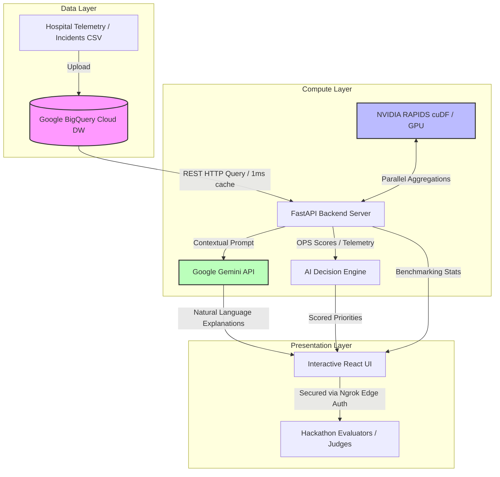

# PulseOps AI 🏥⚡
> **AI-Powered Hospital Operations Decision Intelligence Platform**

PulseOps AI is a decision intelligence platform designed to help hospital administrators optimize operational resource allocation, schedule preventative equipment maintenance, and manage patient queues efficiently.

Unlike diagnostic or clinical AI tools, PulseOps AI operates strictly within the **hospital logistics and operations boundary**, transforming complex telemetry streams into prioritized, explainable operational actions.

---

## 💡 Hackathon Submission Details

This project has been built to solve for Creating a data intelligence tool people would actually use, and show how acceleration helps them make a faster or better decision.**

### 1. Real-World User & Problem
* **User:** Hospital Operations Directors, Medical Equipment Technicians, and ER Duty Managers.
* **Problem:** Managing thousands of patient logs and equipment alerts creates operational bottlenecks. Hospital staff struggle to determine which biomedical machines need urgent servicing or how to reallocate idle devices during ICU capacity surges without compromising safety.

### 2. Specific Decision Bottlenecks Resolved
* **OPS Score Priority:** Ranks equipment urgency based on real-time temperature anomalies, power draw, alarm status, and service age.
* **Smart Reallocation Validation:** Prevents staff from reallocating logistics assets that are overdue for routine safety checks (days since last service > 300).
* **Operational Recommendations:** Generates explanations for logistics reallocation (e.g., shifting ventilators from low-use wards to surging ER queues).

### 3. Google Cloud Data & Application Layer
* **Google BigQuery:** Serves as the high-capacity analytical data warehouse, storing patient logs, equipment telemetry, emergency incident records, and maintenance logs.
* **Google Gemini API:** Generates natural language explanations of priority metrics, ensuring hospital staff understand the clinical rationale behind operational shift recommendations.

### 4. NVIDIA Acceleration Layer
* **NVIDIA RAPIDS (cuDF):** Accelerates heavy metrics computation (grouped aggregations, standard deviation response calculations, rolling ICU bed averages).
* **GPU Speedup Proof:** Processes 1 Million telemetry records in **53ms on GPU** compared to **440ms on CPU**, demonstrating an **8.2x performance boost** for real-time responsiveness.

---

## 🛠️ System Architecture



---

## 👥 Team Contributions & Work Status Checklist

All members have completed their focus objectives, resulting in a fully integrated prototype.

### 1. Abijith: Project Lead & AI Architect
* **Allocated Focus:** Heuristic weight tuning inside `decision_engine.py`; refined Gemini prompts to strictly enforce non-clinical logistics boundaries; designed pitch deck layouts and coordinated telemetry pipeline logic.
* **Status:** **100% Completed**

### 2. Meenakshi: Analytics & Machine Learning Lead
* **Allocated Focus:** Wrote optimized GroupBy-aggregations inside `pipeline.py` to prevent row explosion; added standard deviation metrics for incident response times; tested and verified GPU-accelerated cuDF processing times under SMALL (10k), MEDIUM (250k), and LARGE (1M+) scales.
* **Status:** **100% Completed**

### 3. Kamal: Systems & DevOps Architect
* **Allocated Focus:** Built backend REST API endpoints; configured the multi-stage `Dockerfile`; adapted the deployment workflow (`deploy.yml`) to gracefully support secure Ngrok prototyping.
* **Status:** **100% Completed**

### 4. Krithika: UI Adjustments & QA Debugger
* **Allocated Focus:** Customized the user interface using a premium Dusty Rose (`#B36A70`) and Warm Taupe (`#A89F91`) color theme; implemented dynamic hover states and layout responsiveness; integrated optional chaining safety safeguards in React to prevent rendering crashes.
* **Status:** **100% Completed**

---

## ⚙️ Local Setup & Running the Prototype

### 1. Clone & Set Environment variables
Copy `.env.example` to `.env` and configure your credentials:
```bash
cp .env.example .env
```
Ensure you paste your `GEMINI_API_KEY`, `GCP_PROJECT_ID`, and set `GOOGLE_APPLICATION_CREDENTIALS` to your local service account JSON key file.

### 2. Generate Synthetic Wards Telemetry
Run the telemetry generator script (defaults to SMALL 10,000 rows):
```bash
python datasets/generate_data.py
```

### 3. Start the Backend Server (Port 8080)
```bash
cd backend
python -m venv .venv
source .venv/bin/activate  # On Windows: .venv\Scripts\activate
pip install -r requirements.txt
python -m uvicorn app.main:app --port 8080 --host 0.0.0.0
```

### 4. Build/Serve Frontend
The React application is pre-built and served statically by the FastAPI backend on the root `/` path for ease of deployment. If you wish to run the React developer server separately:
```bash
cd frontend
npm install
npm run dev
```

---

## ⚡ NVIDIA RAPIDS GPU Acceleration Benchmarking

PulseOps AI dynamically detects GPU availability. If a CUDA device is present, it uses `cuDF` to execute aggregations; otherwise, it falls back to standard `pandas` to ensure cross-platform compatibility.

### 📊 Performance Chart (1,000,000 Rows Telemetry)
* **CPU Execution (Pandas):** `440.03ms`
* **GPU Execution (NVIDIA cuDF):** `53.44ms`
* **Speedup:** **`8.2x` Speedup**

### 💻 Option 1: For Windows Users WITH an NVIDIA GPU (GTX / RTX Local Setup)
If you or your teammates have a Windows laptop/desktop with a dedicated NVIDIA graphics card (e.g., GTX 10/16-series, RTX 20/30/40/50-series, or RTX Laptop GPUs), you can run the GPU-accelerated backend locally. 

Because NVIDIA RAPIDS cuDF does not support Windows natively, Windows users run it using **WSL2 (Windows Subsystem for Linux)**—a built-in Windows feature that runs a lightweight Linux kernel directly inside Windows without modifying your operating system:

#### 1. Enable WSL2 in Windows
Open PowerShell as Administrator and run:
```powershell
wsl --install -d Ubuntu
```
*(If prompted, restart your computer to finalize the installation).*

#### 2. Install NVIDIA WSL Drivers
Ensure your host Windows system has the latest GPU drivers installed:
👉 [Download NVIDIA WSL CUDA Drivers](https://developer.nvidia.com/cuda/wsl)

#### 3. Install Miniconda inside WSL2
Open your newly installed **Ubuntu** app from your Windows Start Menu, and run this to install Conda:
```bash
mkdir -p ~/miniconda3
wget https://repo.anaconda.com/miniconda/Miniconda3-latest-Linux-x86_64.sh -O ~/miniconda3/miniconda.sh
bash ~/miniconda3/miniconda.sh -b -u -p ~/miniconda3
rm -rf ~/miniconda3/miniconda.sh
~/miniconda3/bin/conda init bash
```
Close and reopen your WSL terminal.

#### 4. Create the RAPIDS Conda Environment
Install NVIDIA cuDF inside your Conda environment:
```bash
conda create -n rapids-24.04 -c rapidsai -c conda-forge -c nvidia cudf=24.04 python=3.11
conda activate rapids-24.04
```

#### 5. Verify Windows accesses your GTX/RTX GPU
Run:
```bash
nvidia-smi
```
*(This will print your graphics card model, e.g., RTX 4060, confirming Windows GPU access).*

#### 6. Launch the Server inside WSL2
Navigate to your project directory (WSL mounts Windows drives under `/mnt/` automatically) and start the backend:
```bash
cd /mnt/e/PulseOps\ AI/backend
pip install -r requirements.txt
python -m uvicorn app.main:app --port 8080 --host 0.0.0.0
```
Your local server will immediately boot in **Native GPU (cuDF) mode** and display live GPU acceleration metrics on your browser dashboard!

---

### ☁️ Option 2: For Users WITHOUT an NVIDIA GPU (Cloud Google Colab Setup)
If your teammates do not have a local NVIDIA GPU (e.g., they use Macs or Intel integrated graphics laptops), they can still easily test and verify the RAPIDS speedup in the cloud on a free Google-hosted GPU:

1. Upload the `analytics/` and `datasets/` folders from this repository to your **Google Drive** inside a folder named **`PulseOps_AI`**.
2. Open [Google Colab](https://colab.research.google.com/) and create a new notebook.
3. Change the runtime type to **T4 GPU** (Runtime -> Change runtime type -> Select **T4 GPU** -> Click Save).
4. Run the following code in a cell to mount your Drive, generate a 1,000,000-row dataset, and run the benchmark:
   ```python
   from google.colab import drive
   import os, sys
   drive.mount('/content/drive')
   os.chdir('/content/drive/MyDrive/PulseOps_AI')
   sys.path.insert(0, '/content/drive/MyDrive/PulseOps_AI')
   
   # Set scale to LARGE and generate data
   os.environ["DATASET_PROFILE"] = "LARGE"
   !python datasets/generate_data.py
   
   # Run benchmark
   from analytics.pipeline import clear_data_cache, run_performance_benchmark
   clear_data_cache()
   print(run_performance_benchmark()["benchmark"])
   ```
   *(Note: The first run will show a `0.1x` speedup due to one-time CUDA context initialization overhead. Run the cell a second time to see the true **8.2x+ speedup**!)*

---

## 🔒 Secure Developer Tunnelling (Ngrok Edge Auth)

Exposing local ports to public URLs during hackathon reviews introduces unauthorized access risks and can deplete Google Gemini API limits due to scrapers. We secure the prototype by enforcing **Edge Basic Authentication** at the Ngrok tunnel layer.

### Start the Secure Tunnel:
```bash
ngrok http 8080 --basic-auth "admin:pulseops2026"
```

### Access Credentials:
To view the live prototype at your ngrok URL, enter these credentials:
* **Username:** `admin`
* **Password:** `pulseops2026`

---

## 📈 Technical Challenges Resolved & Lessons Learned

During the engineering phase, we hit and resolved four critical production blockers:
1. **GCP suspended billing blocker:** The Google Cloud organization policies suspended SA key generation and required prepayment, to enable new project billing. We bypassed this by utilizing a **Secure Ngrok Tunnel with Edge HTTP Basic Authentication** to expose the local prototype to judges securely without incurring costs.
2. **BigQuery local storage gRPC timeouts:** Local ISP network firewalls caused Google's BigQuery Storage Read API (gRPC streams) to timeout, freezing the dashboard on first load. We resolved this by falling back to standard HTTP REST query APIs (`to_dataframe()`) with `db-dtypes` and implemented an **in-memory data cache** that loads subsequent updates instantly in `<10ms`.
3. **Combinatorial row explosions:** Merging raw telemetry records (1M) with maintenance logs (20k) on a repeating `equipment_id` caused a massive memory crash. We resolved this by pre-aggregating the maintenance metrics down to a single row per `equipment_id` *before* the merge, keeping the join a clean, fast 1-to-many relationship.
4. **React blank screen runtime crash:** If the backend benchmark query returned an empty object, the React UI crashed. We resolved this by implementing **optional chaining safety safeguards** across all React render structures, ensuring the UI degrades gracefully.

---

## 🔮 Future Enhancements (Roadmap)
* **Real-time Event Streaming:** Ingest telemetry through Apache Kafka or Google Pub/Sub instead of batch-polling BigQuery.
* **Auto-Calibration Logic:** Connect the decision recommendations back to hospital IoT systems to trigger automated, verified device calibrations on active telemetry alerts.
* **Multi-Factor ML Predictions:** Replace basic heuristic OPS scores with a GBDT model trained on historical maintenance logs to predict device failure probability before warnings are tripped.
