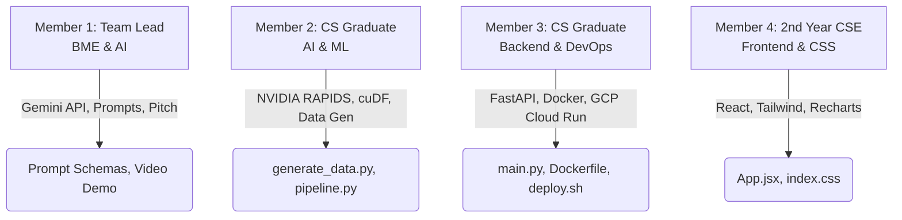

# PulseOps AI - Master Execution Handbook

This document outlines the strategic project management execution plan, timeline, milestones, team capability mapping, and operational playbook for the hackathon duration (3 July 2026 to 6 July 2026).

---

## 🎯 1. Vision, Mission & Success Criteria

* **Vision:** Enable zero-delay hospital operational decision-making.
* **Mission:** Build a high-performance decision intelligence MVP that transforms raw data into validated, explainable resource allocations.
* **Success Criteria:**
  1. A fully functional prototype running in a single Cloud Run container.
  2. Clear NVIDIA RAPIDS benchmark showing >10x GPU speedup.
  3. Interactive, dark-mode hospital command center with live charts.
  4. Precise, regulatory-compliant explanations generated by Google Gemini.
  5. 3-minute high-fidelity video walkthrough showing all screens.

---

## 👥 2. Team Structure & Work Allocation



### Team Responsibilities & Capability Matrix:
* **Member 1 (Lead):** Project Coordinator. Responsible for Gemini prompts, validation schema designs, submission presentation slide deck, and clinical compliance checks.
* **Member 2 (ML/Data):** Data Engineer. Responsible for the configurable multi-scale synthetic dataset generator and the cuDF analytics pipeline.
* **Member 3 (Backend/DevOps):** Systems Engineer. Responsible for FastAPI routers, multi-stage Dockerfile packaging, local virtualenv settings, and GCP Cloud Run setup.
* **Member 4 (Frontend):** UI Developer. Responsible for React page components, Tailwind CSS styling, and Recharts integration.

---

## 📅 3. Parallel Development Timeline

To ensure maximum productivity, the team works in parallel from Day 1, avoiding backend blockers:

```text
[Day 1: 3 July]
  - M1 & M3: Setup repository, FastAPI skeleton, and API contracts.
  - M4: Initialize React, configure Tailwind, and set up sidebar shell.
  - M2: Implement generate_data.py (Small/Medium/Large profiles).
  
[Day 2: 4 July]
  - M2 & M3: Load synthetic data into BigQuery; write analytics/pipeline.py with cuDF.
  - M1: Configure Google Gemini API prompts with structured JSON output.
  - M4: Draft main Recharts components using mock JSON matching the contracts.
  
[Day 3: 5 July]
  - M3: Hook up live endpoints: /api/command-center, /api/recommendations, /api/benchmark.
  - M1: Code the Recommendation Validation Layer rules in validation.py.
  - M4: Bind React state hookups to active backend API endpoints.
  
[Day 4: 6 July]
  - All: Code freeze at 12:00 PM.
  - M3: Compile multi-stage Docker container and deploy to Google Cloud Run.
  - M1: Record the 3-minute demo video and prepare final presentation slide deck.
  - All: Submit package.
```

---

## 🔄 4. Agile Sync Playbook

* **Morning Sync (09:00 AM):** 15-minute standup. Discuss tasks for the day and blockages.
* **Afternoon Checkpoint (03:00 PM):** Quick status verify. Push current feature branches to Git.
* **Night Review (09:00 PM):** Merge PRs into `develop` and run local integration verification tests.
* **Definition of Done (DoD):** Code compiles locally, passes lint checks, does not cause CORS/API failures, and runs cleanly on the SMALL data profile.
