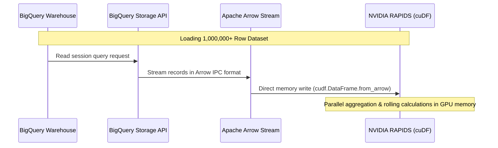

# PulseOps AI - Technical Design Bible

This document details the software design specifications, database tables, API contracts, and logical flows for the PulseOps AI prototype.

---

## 💾 1. Central Analytical Data Warehouse (BigQuery)

Historical operational logs are stored in Google BigQuery. The schema is optimized for column-oriented aggregation queries:

### Tables & Fields:
1. **`equipment_telemetry`**
   * `log_id` (INT64): Unique log entry.
   * `equipment_id` (STRING): Unique asset identifier.
   * `name` (STRING): Device category.
   * `department` (STRING): Physical unit location.
   * `utilization_rate` (FLOAT64): Active cycle percentage.
   * `temperature` (FLOAT64): Device temperature metric.
   * `power_draw` (FLOAT64): Active power consumption.
   * `alarm_status` (INT64): status code (0=Normal, 1=Warning, 2=Critical).
   * `timestamp` (TIMESTAMP): Log event time.

2. **`maintenance_records`**
   * `record_id` (INT64): Maintenance ticket.
   * `equipment_id` (STRING): Target device.
   * `technician_assigned` (STRING): Staff name.
   * `downtime_hours` (INT64): Active device downtime.
   * `days_since_last_service` (INT64): Elapsed service timeframe.
   * `maintenance_type` (STRING): Service classification.

3. **`bed_occupancy_logs`**
   * `timestamp` (TIMESTAMP): Event log time.
   * `icu_beds_occupied` (INT64), `icu_beds_total` (INT64)
   * `er_beds_occupied` (INT64), `er_beds_total` (INT64)
   * `emergency_queue_length` (INT64): Patients awaiting bed assignments.

4. **`emergency_incident_log`**
   * `incident_id` (STRING): Event ticket.
   * `department` (STRING): Triggering unit.
   * `incident_type` (STRING): Event class.
   * `severity` (STRING): Event severity.
   * `equipment_required` (STRING): Logistics device requirement.
   * `response_time_min` (INT64), `resolution_time_min` (INT64)
   * `status` (STRING): Event status.

---

## 🔄 2. BigQuery-Arrow-RAPIDS Streaming Flow

To optimize high-volume queries, data loads directly into GPU memory via the BigQuery Storage API stream in Apache Arrow format, eliminating CPU serialization bottlenecks:



---

## 📡 3. REST API Contract Specifications

All API payloads conform to strict JSON structures:

### `GET /api/health`
* **Purpose:** Verifies operational readiness.
* **Response (200 OK):**
  ```json
  {
    "status": "healthy",
    "dataset_profile": "SMALL",
    "gcp_project": "gcp-project-104"
  }
  ```

### `GET /api/command-center`
* **Purpose:** Summarizes active logistics state.
* **Response (200 OK):**
  ```json
  {
    "status": "active",
    "icu_occupied": 30,
    "icu_total": 50,
    "er_occupied": 40,
    "er_total": 80,
    "er_queue_length": 5,
    "active_incidents_count": 0,
    "active_incidents": [],
    "critical_alarms_count": 0
  }
  ```

### `GET /api/recommendations`
* **Purpose:** Yields priority reallocations with Gemini briefings.
* **Response (200 OK):**
  ```json
  [
    {
      "recommendation_id": "REC-001",
      "action": "Move Ventilator V-014 from ICU to Emergency",
      "operational_priority_score": 92,
      "confidence": 94,
      "reasoning": "Emergency incident surge has created equipment deficit while ICU utilization is under 30%.",
      "expected_impact": "Reduces emergency incident response times by an estimated 18%.",
      "alternative": "Deploy standby ventilator from inventory; note that this requires a 45-minute calibration delay.",
      "generated_at": "2026-07-03T12:00:00Z",
      "gemini_explanation": "OPERATIONAL BRIEFING: This action has been prioritized due to an Operational Priority Score of 92/100..."
    }
  ]
  ```

---

## 🤖 4. AI Explanation prompt structure (Google Gemini API)

The platform compiles validated recommendations and passes them to the Gemini API (`gemini-1.5-flash` model) using a structured instruction frame:

```text
Act as an elite Hospital Operations Decision Support Coordinator.
Your job is to translate a structured machine-generated resource recommendation into a clear, professional, and persuasive briefing for a hospital administrator.

STRUCTURED RECOMMENDATION DATA:
- Action: {action}
- Operational Priority Score: {operational_priority_score}/100
- Base Reasoning Factors: {reasoning}
- Expected Operational Impact: {expected_impact}
- Alternative Option: {alternative}

INSTRUCTIONS:
1. Keep the briefing concise (3-4 sentences maximum).
2. Focus strictly on logistical efficiency, resource allocation, and equipment health.
3. Do NOT make clinical or medical recommendations.
4. Do NOT calculate or change any scores. Use the provided Operational Priority Score (OPS).
```
